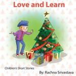

# Love and Learn

_Love and Learn_ is a collection of short, poignant children’s stories and animal fables. Each tale portrays a child’s confusion when encountering a challenge, and illustrates the understanding and growth. The lessons learned are an important part of growing up, and make an entertaining read.

**The book is available for free.**

[Love and Learn @ Library of Canada](https://bac-lac.on.worldcat.org/oclc/1032962286)

[EPUB](https://www.lulu.com/shop/rachna-srivastava/love-and-learn/ebook/product-20262996.html?page=1&pageSize=4)

[EPUB](Love_and_Learn_general.epub)

[PDF](9780988122406.pdf)

[Kindle US](http://www.amazon.com/Love-and-Learn-ebook/dp/B008JQGXTE/)

